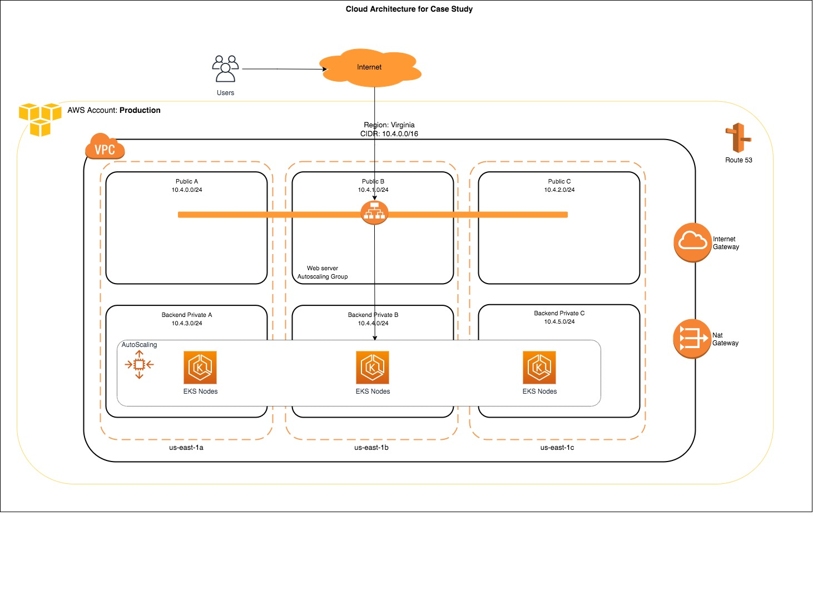

# Repository for the EKS Infrastructure in AWS

## Features

* `./cloudformation-infra/` Contains cloudformation files to deploy the VPC.
* `./terraform-eks/` Contains tf files to deploy a EKS cluster over above infrastructure.


## Architecture



## How to use

1. Deploy VPC:

* Copy the yaml files from `./cloudformation-infra/` into a S3 Bucket (Ex. MyBucket).
* In the AWS console, go to Cloudformation service and create a new stack with the URL for the master
file (ex, https://MyBucket.s3.amazonaws.com/master.yaml).
* In the Specify stack details window add as following:
    * In the Stack Name write one of the following names:
        * OPS
        * DEV
        * QA
        * PROD
        
    * In the SourceCode verify the name of the Bucket (Ex. MyBucket) where the yaml files were saved.
    
2. Deploy EKS:
* Add the private subnets IDs created in the previous step in the file `./terraform-eks/main.tf`:

```
  subnets         = ["subnet-0c27636ae347e01e7", "subnet-032f530b700ba3a7d", "subnet-040a5a687412aa3f8"] 

```
* Set the AWS credentials:

````
aws config
````

* Deploy the EKS cluster:


````
terraform init
terraform plan
terraform apply
````